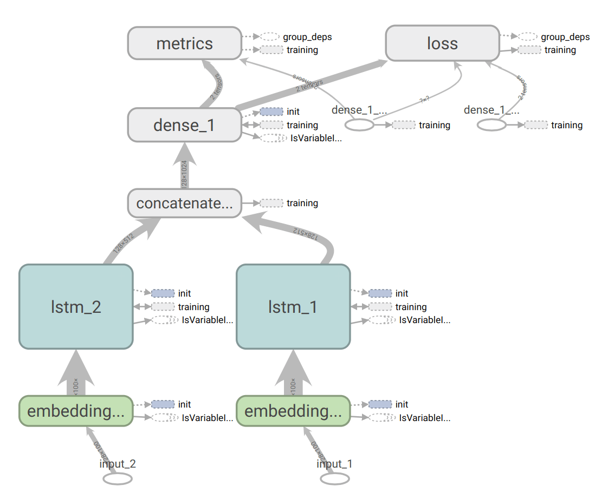
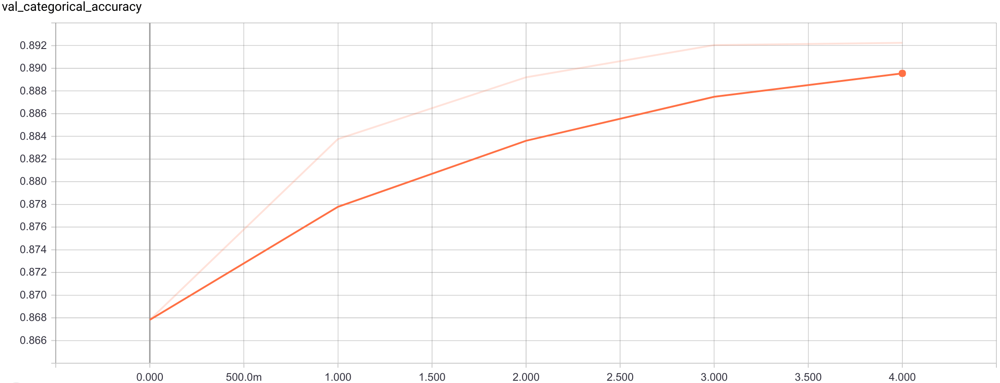
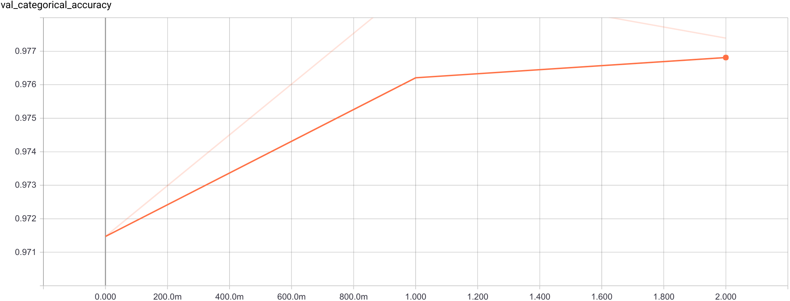

Code Neuron
===========

Recurrent neural network to detect code blocks. Runs on Tensorflow. It is trained in two stages.

First stage is pre-training the character level RNN with two branches - before and after:



```
my code :  FooBar
------> x <------
```

We assign recurrent branches to different GPUs to train faster.
I set 512 LSTM neurons and reach 89% validation accuracy over 200 most frequent character classes:



The second stage is training the same network but with the different dense layer which predicts
only 3 classes: code block begins, code block ends and no-op.
The prediction scheme changes: now we look at the adjacent chars and decide if there is a code boundary
between them or not.



It is much faster to train and it reaches **~99.2% validation accuracy**.

Training set
------------

[StackSample questions and answers](https://www.kaggle.com/stackoverflow/stacksample), processed with

```
unzip -p Answers(Questions).csv.zip | ./dataset | sed -r -e '/^$/d' -e '/\x03/ {N; s/\x03\s*\n/\x03/g}' | gzip >> Dataset.txt.gz
```

Baked model
-----------

[model_LSTM_600_0.9924.pb](model_LSTM_600_0.9924.pb) - reaches 99.2% accuracy on validation. The model
in Tensorflow "GraphDef" protobuf format.

Pretraining was performed with 20% validation on the first 8000000 bytes of the uncompressed questions.
Training was performed with 20% validation and 90% negative samples on the first 256000000 bytes of
the uncompressed questions.
This means I was lazy to wait a week for it to train on the whole dataset - you are encouraged
to experiment.

Try to run it:

```
cat sample.txt | python3 run_model.py -m model_LSTM_600_0.9924.pb
```

You should see:

```
Here is my Python code, it is awesome and easy to read:
<code>def main():
    print("Hello, world!")
</code>Please say what you think about it. Mad skills. Here is another one,
<code>func main() {
  println("Hello, world!")
}
</code>As you see, I know Go too. Some more text to provide enough context.
```

Visualize the trained model:

```
python3 model2tb.py --model-dir model_LSTM_600_0.9924.pb --log-dir tb_logs
tensorboard --logdir=tb_logs
```

Go inference
------------

```
go get gopkg.in/vmarkovtsev/CodeNeuron.v1/...
cat sample.txt | $(go env GOPATH)/bin/codetect
```

API:

```go
import "gopkg.in/vmarkovtsev/CodeNeuron.v1"

func main() {
  textBytes, _ := ioutil.ReadFile("sample.txt")
  result, _ := codetect.Run(string(textBytes))
}
```

#### Updating the model

```
go-bindata -nomemcopy -nometadata -pkg assets -o assets/bindata.go  model.pb
```

License
-------

MIT, see [LICENSE](LICENSE).